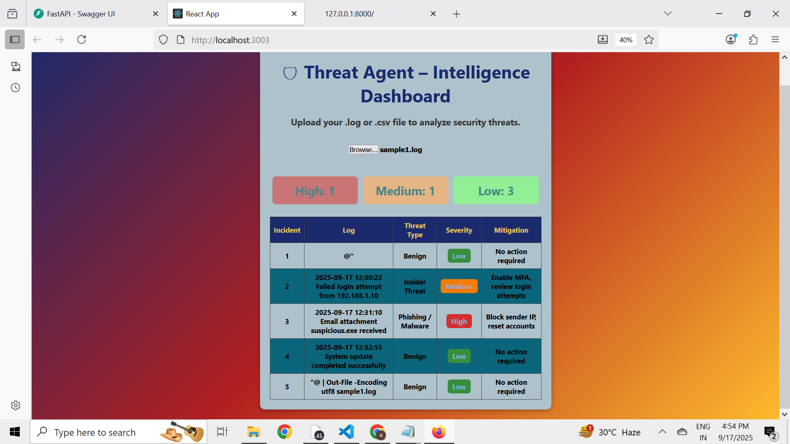

# 🛡 Threat Agent – Intelligence Dashboard

An AI-powered cybersecurity log analysis tool built with **FastAPI (backend)** and **React (frontend)**.  
It detects potential threats from uploaded `.log` or `.csv` files and classifies them into **High / Medium / Low severity** with suggested mitigation.

---

## 🚀 Features
- Upload `.log` or `.csv` security log files
- Automated **threat classification**
- Categorizes into:
  - 🔴 High (Phishing/Malware, suspicious executables)
  - 🟠 Medium (Insider login anomalies)
  - 🟢 Low (Benign activity)
- Displays results in **colored summary cards + table**
- FastAPI backend + React frontend

---

## 📷 Demo Screenshot  

Here’s a sample output from the app analyzing `sample1.log`:  



---

## 🛠️ Tech Stack
- **Backend:** FastAPI, Python
- **Frontend:** React, CSS
- **Others:** CORS, CSV parsing

---

## ⚡ Getting Started

### 1️⃣ Clone the repo
```bash
git clone https://github.com/ashna18ash/threat-agent.git
cd threat-agent
